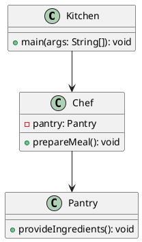

# Dependency Injection

## Not just function arguments

<!--
The last comment block of each slide will be treated as slide notes. It will be visible and editable in Presenter Mode along with the slide. [Read more in the docs](https://sli.dev/guide/syntax.html#notes)
-->

---
transition: fade-out
hideInToc: true
---

# Table of Contents

<Toc />

---
layout: quote
---

# What is Dependency Injection?

<v-click>
  <h2> "Dependency Injection is a style of <strong>Inversion of control (IoC)</strong>"</h2>
  <p> - Martin Fowler (2004)</p>
</v-click>

---
level: 2
---

# Inversion of Control pattern

## The Inversion-of-Control (IoC) pattern, is about providing any kind of callback, which "implements" and/or controls reaction, instead of acting ourselves directly.

````md magic-move
```ts
// Procedural Approach

function fetchData() {
	console.log("Fetching data...");
	// async data fetching
	return "Data from the server";
}

function processData(data) {
	console.log("Processing data: " + data);
}

const data = fetchData();
processData(data);
```

```ts {all|13|2|6|9-10}
// IoC Approach using a callback
function fetchData(callback) {
	console.log("Fetching data...");
	// async data fetching
	const data = "Data from the server";
	callback(data); // Control is inverted here
}

function processData(data) {
	console.log("Processing data: " + data);
}

fetchData(processData); // Instead of controlling the flow directly, we pass control to fetchData
```
````

<v-click>
  <strong> -> separating what to do from when to do it. </strong>
</v-click>

---
level: 2
layout: image
image: /man-fridge.jpg
---

---
layout: center
---



---
level: 2
title: DI in frameworks
---

# Java Spring example

````md magic-move
```java
public class Kitchen {
  public static void main(String[] args) {
    var assistant = new AnnotationConfigApplicationContext(Chef.class, Pantry.class); // IoC Container
    var chef = assistant.getBean(chef.class);
    chef.prepareMeal(); // What's the output?
  }
}

class Chef {
  private Pantry pantry;

  public void prepareMeal() {
    pantry.provideIngredients();
    System.out.println("Cooking the meal! ");
  }
}

class Pantry {
  public void provideIngredients() {
    System.out.println("Providing fresh ingredients!");
  }
}
```

```java {5}
public class Kitchen {
  public static void main(String[] args) {
    var assistant = new AnnotationConfigApplicationContext(Chef.class, Pantry.class); // IoC Container
    var chef = assistant.getBean(chef.class);
    chef.prepareMeal(); // Error: NullPointerException
  }
}

class Chef {
  private Pantry pantry;

  public void prepareMeal() {
    pantry.provideIngredients();
    System.out.println("Cooking the meal! ");
  }
}

class Pantry {
  public void provideIngredients() {
    System.out.println("Providing fresh ingredients!");
  }
}
```

```java {10}
public class Kitchen {
  public static void main(String[] args) {
    var assistant = new AnnotationConfigApplicationContext(Chef.class, Pantry.class); // IoC Container
    var chef = assistant.getBean(chef.class);
    chef.prepareMeal(); // Error: NullPointerException
  }
}

class Chef {
  @Autowired
  private Pantry pantry;

  public void prepareMeal() {
    pantry.provideIngredients();
    System.out.println("Cooking the meal! ");
  }
}

class Pantry {
  public void provideIngredients() {
    System.out.println("Providing fresh ingredients!");
  }
}
```

```java {5}
public class Kitchen {
  public static void main(String[] args) {
    var assistant = new AnnotationConfigApplicationContext(Chef.class, Pantry.class); // IoC Container
    var chef = assistant.getBean(chef.class);
    chef.prepareMeal(); // Providing fresh ingredients! Cooking the meal!
  }
}

class Chef {
  @Autowired
  private Pantry pantry;

  public void prepareMeal() {
    pantry.provideIngredients();
    System.out.println("Cooking the meal! ");
  }
}

class Pantry {
  public void provideIngredients() {
    System.out.println("Providing fresh ingredients!");
  }
}
```
````

<!--
The drink field in the Meal class is never initialized, leading to a NullPointerException when drink.consume() is called in the quenchThirst method.
-->


---
title: manual Dependency Injection
layout: quote
class: text-center
---

# Manual Dependency Injection

## For when you don't have a framework

---
level: 2
---

# Components & Involved Actors

- **Service**
  - The object that performs a specific task.
- **Client**
  - The object that depends on the service to perform a task.
- **Injector**
  - The object that injects the service into the client.
  - classically a framework or a container.

---
level: 2
---

# Types of manual Dependency Injection

````md magic-move
```java
// Constructor Injection

public class Client {
  private Service service;

  // constructor injects the service
  public Client(Service service) {
    this.service = service;
  }
}
```

```java
// Setter Injection

public class Client {
  private Service service;

  // Constructor...

  // setter injects the service
  public void injectService(Service service) {
    this.service = service;
  }
}
```

```java
// Interface Injection Example

// Service interface defines a contract for the service
public interface Service {
  void execute();
}

// Client interface defines a contract for injecting a Service
public interface Client {
  void setService(Service service);
}

// MyClient class implements the Client interface
public class MyClient implements Client {
  private Service service;

  // Method to inject the Service implementation
  @Override
  public void setService(Service service) {
    this.service = service;
  }
}
```
````

---
layout: quote
class: text-center
---

# Service Locator Pattern

## The anti pattern

---
level: 2
layout: two-cols-header
---

# Why is it an anti-pattern?

::left::

- **Hidden dependencies**
  - The client is not aware of its dependencies.
- **Tight coupling**
  - The client is tightly coupled to the service locator.
- **Global state**
  - The service locator is a global object.
  - can cause issues with concurrency.
- **Violation of DIP**
  - The service locator violates the Dependency Inversion Principle.
- **Testing**
  - Difficult to test. (compared to DI)

::right::

```java
public class Client {
  public void doSomething() {
    Service service = ServiceLocator.getService();
    service.performTask();
  }
}
```

---
layout: quote
transition: fade-out
---

# Should you use Dependency Injection?

---
title: Pros & Cons
layout: two-cols
level: 2
---

# Pros

- ✅ Testability
  - Combined with the mocking pattern
- ✅ Modularity
  - Combined with the strategy pattern
- ✅ Flexibility
  - Easily swap out implementations without changing the client code.
- ✅ Reusability
  - Services can be reused across different clients and applications.

::right::

# Cons

- ❌ Complexity
- ❌ Boilerplate code
- ❌ Configuration

---

# Sources

- \[1\] 
  - M. Fowler, "Inversion of Control Containers and the Dependency Injection pattern," martinfowler.com, 2004. \[Online\]. Available: https://martinfowler.com/articles/injection.html. \[Accessed: Nov. 14, 2024\].
- \[2\] 
  - M. Fowler, "Inversion of Control," martinfowler.com, 2005. \[Online\]. Available: https://martinfowler.com/bliki/InversionOfControl.html. \[Accessed: Nov. 14, 2024\].
- \[3\] 
  - C. McKenzie, "What is Dependency Injection?," YouTube, 2019. \[Online\]. Available: https://www.youtube.com/watch?v=gD3TWLkHw4w. \[Accessed: Nov. 14, 2024\].
- \[4\] 
  - CodeAesthetic, "Dependency Injection, The Best Pattern," YouTube, 2020. \[Online\]. Available: https://www.youtube.com/watch?v=J1f5b4vcxCQ&t=1s. \[Accessed: Nov. 14, 2024\].


---

- \[5\] 
  - CareerExperts, "A-Guide-to-Fridge-Storage-in-a-Commercial-Kitchen," example.com, 2022. \[Online\]. Available: https://www.careerexperts.co.uk/wp-content/uploads/2022/01/A-Guide-to-Fridge-Storage-in-a-Commercial-Kitchen.jpg. [Accessed: Nov. 14, 2024\].
  

---
layout: end
---

# Thank you!
